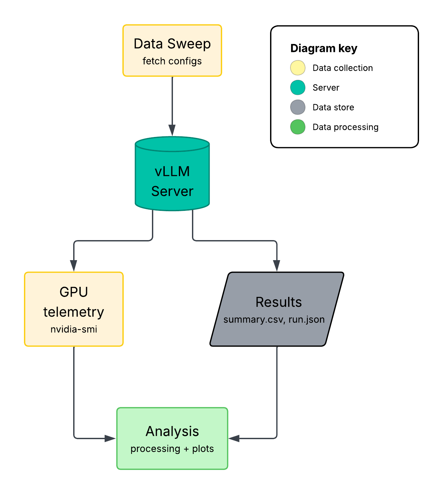
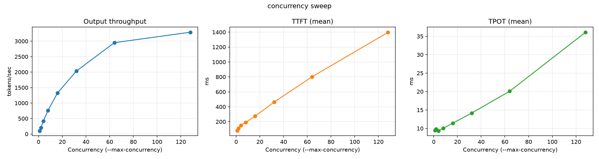
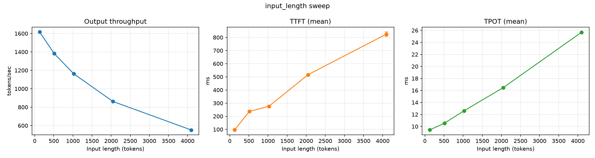
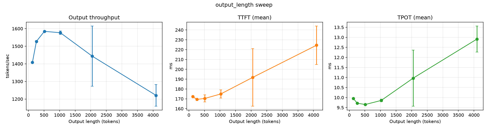

# Investigating Tradeoffs of Local LLM Serving

## Introduction
This study focuses on the tradeoffs of performance and cost-effectiveness of LLM serving on consumer GPUs such as the NVIDIA RTX 5080. 
I recently got ahold of a souped up PC and decided to build my own inference server to develop an understanding of a vLLM-based server's throughput and latency.  

To conduct this study, I have structured the project accordingly:

## Method

My methodology is designed around the following steps:

1. To make sure there is a stable working environment, validate that vLLM serves a model end-to-end on the local machine.

2. To understand the effect on throughput and latency, identify the variables of this study (concurrency, token length, etc.)

3. To use the GPU optimally, do a smoke test to validate the experimental design.

4. Collect enough data to establish relationships between throughput/latency and the control variables. 

5. Look for a positive relationship between: 
&nbsp;&nbsp;&nbsp;&nbsp;- concurrency and throughput 
&nbsp;&nbsp;&nbsp;&nbsp;- concurrency and latency 
&nbsp;&nbsp;&nbsp;&nbsp;- token length and latency 
and an inverse relationship between: 
&nbsp;&nbsp;&nbsp;&nbsp;- token length and throughput 

6. Additional investigations that I plan to do are mentioned below in [next steps](#next-steps)

Lets get into how I went about achieving above steps:
- I ensured end-to-end model service on WSL2 (not trivial, I ran into several CUDA + Python compatibility gaps between WSL2's behavior and vLLM's model runner)
- I designed the sweep configs around 3 variables (batch size, input token length, and output token length) by isolating different part of the server's request lifecycle (prefill vs. decode) 
- Validated the benchmarking pipeline on a single config before trusting it with larger jobs
- Validated the same pipeline across multiple configs run in sequence
- Ran the first full sweep and analyzed the results

## My findings

What I have found so far regarding each variable's impact on throughput and latency: 

**Concurrency** 
  - Throughput (tokens/sec): scales approximately linearly with concurrency up to a batch size of ~16. Past that, scaling efficiency starts dropping down sublinearly with batch sizes of 32, 64, and 128 requests/batch.
  - TTFT (time-to-first-token, ms): scales approximately linearly with concurrency across all tested batch sizes.
  - TPOT (time-per-output-token, ms): scales approximately linearly with concurrency across all tested batch sizes.

**Input Token Length**
  - Throughput (tokens/sec): scales inversely with input token length
  - TTFT (time-to-first-token, ms): scales approximately linearly with input token length across all tested token lengths. The rate of increase is slightly more irregular compared to the rate of increase in TPOT with the same varied token lengths.
  - TPOT (time-per-output-token, ms): scales approximately linearly with input token length across all tested token lengths.

**Output Token Length**
  - Throughput (tokens/sec): relationship is non-monotonic. A hump peaks around 512 tokens, with a decreasing tail across the last 2 configs of 2048 and 4096 tokens. The last 2 configs display high run-to-run variance.
  - TTFT (time-to-first-token, ms): relationship is non-monotonic. TTFT initially decreases across token lengths of 128 and 256, then begins increasing approximately monotonically across the remaining token lengths. As TTFT begins increasing, however, each tested token length displays non-negligible run-to-run variance.
  - TPOT (time-per-output-token, ms): relationship is non-monotonic. TPOT initially decreases across token lengths of 128, 256, and 512, then begins increasing approximately monotonically across the remaining token lengths. As TPOT begins increasing, however, each tested token length displays non-negligible run-to-run variance.

## Next Steps:
1. Log GPU telemetry (nvidia-smi) alongside the sweep to see whether the sublinear drop-off observed in the concurrency sweep is compute-bound or memory-bandwidth-bound at each concurrency level.
2. To make operation of the server more reproducible and easier to use, parametrize the sweep commands to accept the following as parameters: 
&nbsp;&nbsp;&nbsp;&nbsp;- specific config files to sweep 
&nbsp;&nbsp;&nbsp;&nbsp;- specific models for vLLM to serve 
&nbsp;&nbsp;&nbsp;&nbsp;- option to track GPU metrics alongside data sweeps 
3. To ensure the server is cross-model-compatible, run it with larger, more capable models (e.g. LLama-3.1-8B)
4. Investigate feasibility of connecting other GPUs (e.g. Laptop RTX 3060) over a home network

As AI infrastructure leans more into locally hosting models, understanding on-prem bottlenecks and optimizing accordingly is more important than ever. If you're curious about the project and would like to know more, send me a message and I'll share my repo with you!

Open to feedback from anyone working on AI infrastructure, model benchmarking, and ML optimization! Also open to conversations about opportunities in this space.
